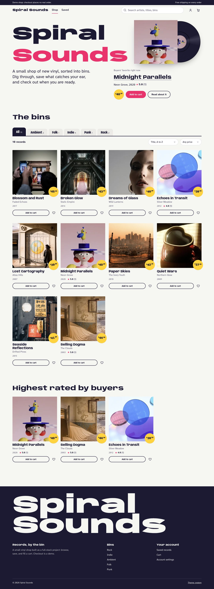

# Spiral Sounds

A small vinyl record shop, built as a full-stack portfolio project. It pairs an Express 5 API on SQLite with a no-build vanilla JavaScript frontend designed like the counter of an independent record store.



The checkout is a demo. Orders are recorded and stock goes down, but no payment is taken and nothing ships. The site says so in a strip at the top of every page.

## What you can do

- **Browse the bins.** Filter by genre, search by artist or title, sort by title, artist, price, year, or rating, and set a price range. Filters live in the URL, so you can share a view.
- **Open a record.** See the cover with a disc sliding out of its sleeve, the price, stock, facts, buyer reviews, related records, and the records you viewed recently.
- **Save and buy.** Save records for later, add them to a cart drawer, change quantities, and place a demo order. A cart can never hold more copies than are in stock.
- **Manage your account.** Change your display name, see past orders, reset your password by email, and turn on two-step sign-in with an authenticator app and backup codes.
- **Run the shop.** Staff accounts (`admin`, `super_admin`, `moderator`) see a dashboard with catalog, price, review, and stock figures.

The site supports:

- Light and dark themes.
- Phone-width screens, keyboard-only use, and reduced motion.
- Installing as a PWA, with an offline page when the network drops.

## Stack

- **Server:** Node.js 22, Express 5, SQLite (`sqlite` + `sqlite3`), Socket.IO.
- **Auth:** JWT access and refresh tokens in httpOnly cookies, `bcryptjs`, TOTP two-step sign-in (`speakeasy`), role-based access control.
- **Frontend:** static HTML and ES modules in `public/`, with no build step. The fonts are Anybody and Atkinson Hyperlegible Next, from Google Fonts. The content security policy allows scripts from this origin only.
- **Tooling:** Jest 30 (ESM), Supertest, Biome 2, pnpm.

## Quickstart

You need Node.js 22 and pnpm.

```bash
git clone git@github.com:forbiddenlink/spiralsounds.git
cd spiralsounds
pnpm install
cp .env.example .env    # then set JWT_SECRET and SESSION_SECRET
pnpm setup              # migrate, seed, and start
```

Open `http://localhost:8000`, or the port you set in `PORT`. To sign in, use the seeded account `testuser` with the password `TestPassword123!`.

To make an account a staff account, set its role in the database:

```bash
sqlite3 database.db "UPDATE users SET role = 'admin' WHERE username = 'testuser'"
```

## Environment variables

`.env.example` lists every variable with a description. Two are required:

- `SESSION_SECRET`: the server refuses to start without it.
- `JWT_SECRET`: signing tokens fails without it.

Generate each with `openssl rand -base64 32`.

| Variable | Purpose |
|---|---|
| `PORT`, `NODE_ENV`, `CLIENT_URL` | Where the server listens, and the site origin used in emails, CORS, and the cross-site check |
| `DB_PATH` | SQLite file (default `./database.db`) |
| `JWT_SECRET`, `JWT_EXPIRES_IN`, `JWT_REFRESH_EXPIRES_IN` | Token signing and lifetimes |
| `SESSION_SECRET`, `COOKIE_MAX_AGE` | Session cookie |
| `RATE_LIMIT_WINDOW_MS`, `RATE_LIMIT_MAX_REQUESTS` | General API rate limit |
| `EMAIL_SERVICE`, `EMAIL_USER`, `EMAIL_PASS`, `EMAIL_FROM` | Verification and password reset email. Without them, no email is sent; the failure is logged |
| `DISCOGS_CONSUMER_KEY`, `DISCOGS_CONSUMER_SECRET` | Discogs catalog endpoints, which the shop pages do not use yet |
| `TWO_FA_ISSUER`, `TWO_FA_SERVICE_NAME` | Name shown in authenticator apps |

## Scripts

```bash
pnpm start           # node server.js
pnpm dev             # node --watch server.js
pnpm migrate         # run database migrations
pnpm seed            # seed 10 sample records, a test user, and sample reviews
pnpm setup           # migrate, seed, start
pnpm reset-db        # delete database.db, then migrate and seed again
pnpm test            # Jest; each test file gets its own throwaway database
pnpm test:coverage
pnpm biome:check
pnpm biome:fix
```

## Project structure

```
spiralsounds/
├── server.js            # App entry: security headers, CSP, rate limits, routes, 404 page
├── routes/v1/           # Versioned API (see docs/API.md)
├── controllers/         # Request handlers: auth, products, cart, orders, wishlist, me
├── services/            # Analytics, 2FA, Discogs, MusicBrainz, collection
├── repositories/        # Data access helpers
├── middleware/          # Errors and logging, auth, RBAC, rate limits, same-origin check
├── utils/               # JWT, validation, sanitization, email, grading
├── db/                  # Connection, migrator (numbered migrations), seeder
├── public/              # The site: one HTML file per page, js/app/*.js, css/spiral.css, sw.js
├── tests/               # Jest + Supertest specs
└── design-research/     # How the redesign was researched, planned, scored, and verified
```

The frontend modules in `public/js/app/` share one shell and one API client:

- `shell.js`: header, footer, cart drawer, and toasts.
- `api.js`: every call to the API.
- One small module per page, such as `home.js`, `record.js`, and `cart-page.js`.

## Security

- Passwords are hashed with bcrypt. Tokens live in httpOnly, `SameSite=lax` cookies.
- With two-step sign-in on, a correct password returns a 5-minute challenge instead of a session. Each challenge allows 5 wrong codes and works once.
- Each IP gets 5 failed attempts per 15 minutes for sign-in, registration, reset requests, and code checks.
- State-changing API requests from another site are refused by an origin check. This adds to the protection from `SameSite` cookies.
- After sign-in, visitors are only redirected to pages on this site.
- Helmet sets the security headers, and the content security policy allows scripts from this origin only.

## Deployment

This is a standard Node app with no build step:

1. Set the environment variables.
2. Run `pnpm migrate`. On a new database, also run `pnpm seed`.
3. Start with `pnpm start`.

After every upgrade, run `pnpm migrate` again. Migrations are numbered, and each one runs only once.

## Design

The redesign's research, direction, scores, and before and after screenshots are in [`design-research/report.md`](design-research/report.md). Decisions still waiting on the owner are in [`design-research/needs-approval.md`](design-research/needs-approval.md).

## License

MIT. See [LICENSE](LICENSE).
